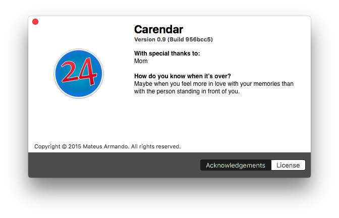

# Carendar

Is your status menu Calendar App done right, 





## Fixes Needed
This Project uses [promise.rb](https://github.com/lgierth/promise.rb), unfortunately it is not completely supported by Rubymotion. In order to make it running patch has to be applied.


1. Download the promise.rb gem
2. Apply the patch that can be found within this project `rubymotion_private_module.patch`


```sh
 # First you should check the changes that might get applied.
 git apply --stat rubymotion_private_module.patch
 
 # check how troublesome the patch will be
 git apply --check rubymotion_private_module.patch
 
 # Let us just apply it
 git am --signoff < rubymotion_private_module.patch

```


